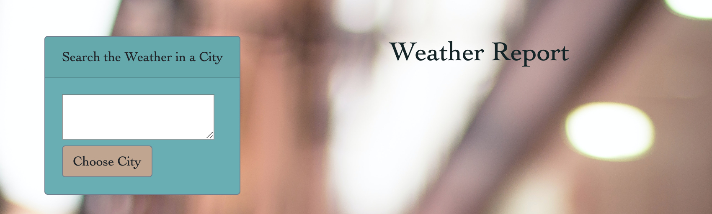
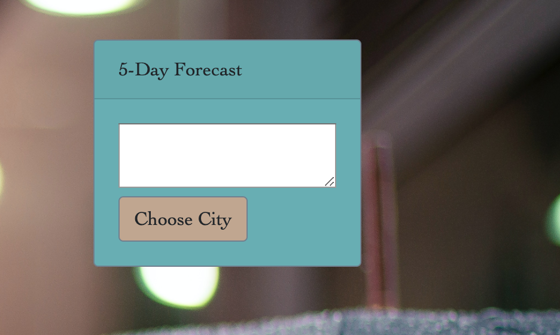
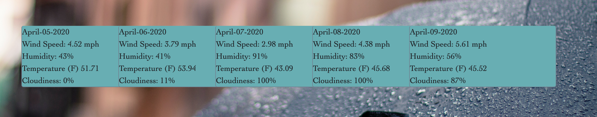

# weather-app

For this website, the user is meant to enter a city name and receive weather related information about that city.

As the user enters, they are presented with a jumbotron with video of clouds moving by as shown in screen-shot1. The subtitle has a funny quip punning on the "keep your head out of the clouds" idiom.

The user is able to enter a city name to get weather information for that day. this is shown in screen-shot2.

The user may also look ahead to the five day forecast and enter a city name for that, as seen in screen-shot3. The array of a five day forecast for Boston is shown in screen-shot4.

Overall, the api functionality is working as planned. The local storage was giving me problems. I could not figure out how get an array into local storage to then loop through that array for information. I want to figure that out as I move forward.

